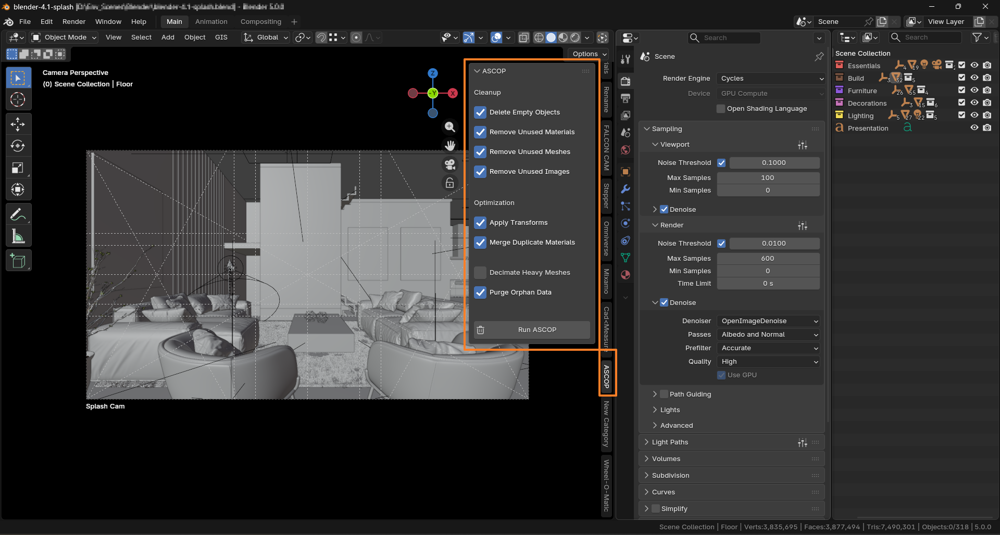

# ASCOP — Auto Scene Cleaner Optimizer


ASCOP (**Auto Scene Cleaner Optimizer**) is a lightweight Blender add-on that automatically **cleans and optimizes Blender scenes with one click**.

It removes unnecessary data, merges duplicate materials, and reduces heavy mesh complexity — helping artists prepare scenes for **rendering, export, or game engines**.

---

# Preview

ASCOP appears as a panel inside the **3D Viewport Sidebar**.

```
3D View → Press N → ASCOP Tab
```

---

# Features

## Scene Cleanup

ASCOP automatically removes unused or unnecessary scene data.

* Delete **empty objects**
* Remove **unused materials**
* Remove **unused meshes**
* Remove **unused images**
* Purge **orphan data blocks**

This keeps scenes organized and reduces memory usage.

---

## Scene Optimization

### Merge Duplicate Materials

Automatically merges materials like:

```
Metal
Metal.001
Metal.002
```

All objects referencing duplicate materials are updated to use the original material.

Benefits:

* Cleaner shader setup
* Reduced shader compilation
* Better project organization

---

### Decimate Heavy Meshes

Meshes exceeding a polygon threshold can automatically receive a **Decimate modifier**.

Example configuration:

```
Poly Threshold: 50000
Decimate Ratio: 0.5
```

Meaning:

```
100k polygons → reduced to ~50k
```

This helps optimize imported models and scanned assets.

---

# Installation

### Method 1 — Download ZIP

1. Download the repository.
2. Open Blender.
3. Go to:

```
Edit → Preferences → Add-ons
```

4. Click **Install**
5. Select the `ascop_auto_scene_cleaner_optimizer.py` file
6. Enable the add-on.

---

### Method 2 — Clone Repository

```
git clone https://github.com/yourusername/ASCOP.git
```

Install the `.py` file as a Blender add-on.

---

# Usage

1. Open **3D Viewport**
2. Press **N**
3. Select **ASCOP tab**
4. Choose desired cleanup/optimization options
5. Click **Run ASCOP**

ASCOP will automatically process the scene.

---

# Example Workflow

Imported asset pack:

```
Objects: 450
Materials: 180
Textures: 120
Total Polycount: 3.8M
```

After running ASCOP:

```
Empties removed: 30
Duplicate materials merged: 90
Unused textures removed: 40
Heavy meshes decimated: 15
```

Scene becomes **cleaner and lighter**.

---

# Screenshots

## ASCOP Panel



---

## Cleanup Example


---

## Decimation Example


---

# Folder Structure

```
ASCOP/
│
├── ascop_auto_scene_cleaner_optimizer.py
├── README.md
├── LICENSE
│
└── docs/
    └── images/
        ├── ascop_panel.png
        ├── cleanup_example.png
        └── decimate_example.png
```

---

# Compatibility

* Blender **5.0+**
* Works with **Cycles and Eevee**
* No external dependencies

---

# Roadmap

Planned future improvements:

* Texture resolution optimizer
* Scene statistics panel
* Object renaming tools
* Batch export for game assets
* LOD generation tools

---

# Contributing

Contributions are welcome.

You can help by:

* Reporting bugs
* Suggesting new features
* Submitting pull requests

---

# License

This project is licensed under the **MIT License**.

---

# Author

**ASCOP — Auto Scene Cleaner Optimizer**

Developed to simplify scene cleanup and optimization in Blender.

---

# Support

If you find ASCOP useful:

* ⭐ Star the repository
* 🐛 Report issues
* 💡 Suggest improvements
